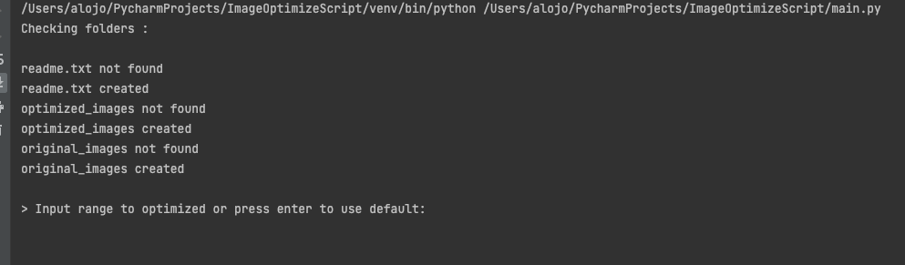
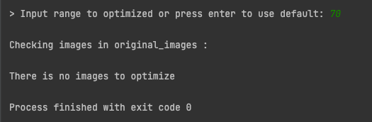
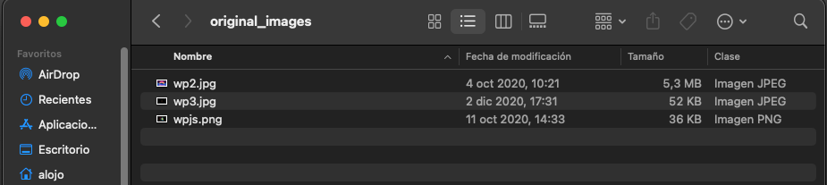
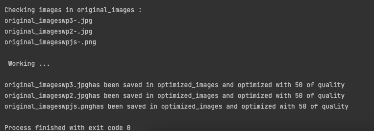
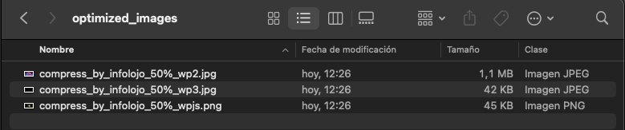

# ImageOptimizedScript

---
### Pillow script app to optimize your images by using your os iu

### run 
* Step 0 (Optional) -> Create virtual env
```
python3 -m venv env
source env/bin/activate
```
* Step 1 -> Install requiremts
```
pip3 install -r requirements.txt
```
* Step 2 -> Run
```
python3 main.py
```

### Usage
After first init the script **will check** files
* readme.txt file -> Contain the docs of the script
* optimized_images folder -> Contain the folder that will be use to store optimized images
* original_images folder -> Contain the folder where user must put the images to optimize

After run script it will show you the log with the actions doned


Then you must enter the range percent of optimization (by default is 60%)


Then it check if there is images in the original_images folder

If you put images in the new folder and run the script 


the result with an 50% of range will be




